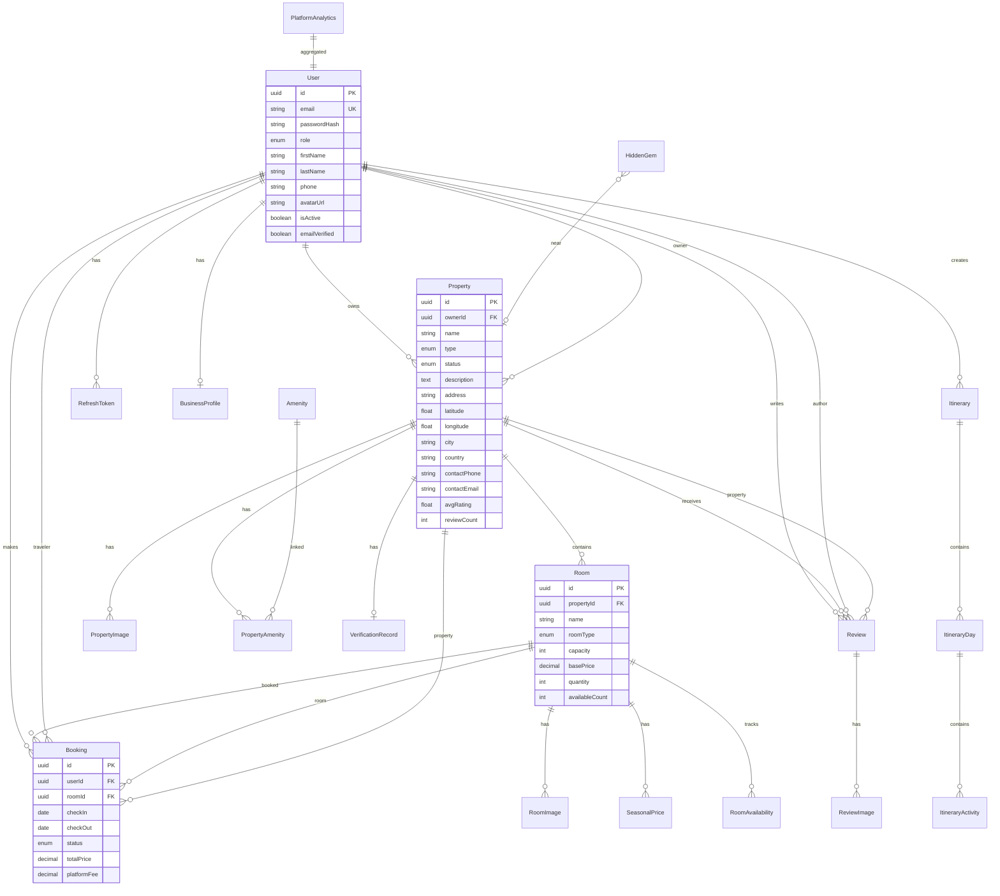

# HiddenStay AI — Entity Relationship Diagram

## Mermaid ERD

## Entity Summary

| Entity | Purpose |
|--------|---------|
| **User** | All accounts; role distinguishes traveler/owner/admin |
| **BusinessProfile** | KYC fields for business owners |
| **RefreshToken** | Hashed refresh token rotation |
| **Property** | Listings with geo, contact, verification status |
| **VerificationRecord** | Admin approval audit trail |
| **Room** | Inventory unit with base price and quantity |
| **SeasonalPrice** | Peak/off/holiday multipliers per room |
| **RoomAvailability** | Per-date availability overrides |
| **Booking** | Reservations with status lifecycle |
| **Review** | Post-stay ratings and text |
| **Itinerary** | AI-generated travel plans |
| **HiddenGem** | Curated local attractions/restaurants |
| **Amenity** | Normalized amenity catalog |
| **PlatformAnalytics** | Daily snapshot metrics for admin dashboard |

## Indexes (Performance)

- `Property(city, country, status, type)`
- `Property(avgRating DESC)` for sort
- `Booking(userId, status)`
- `Booking(roomId, checkIn, checkOut)` for overlap checks
- `Review(propertyId)`
